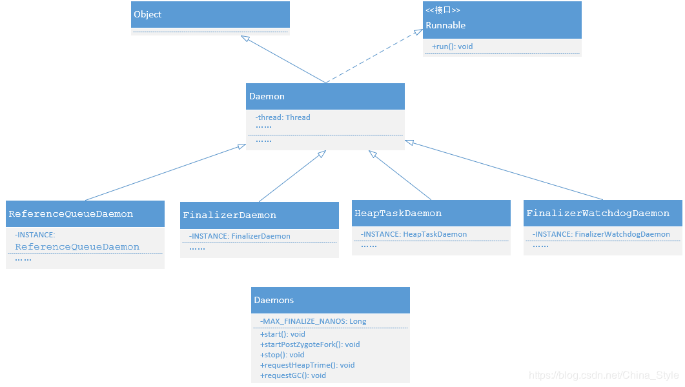

### FinalizerWatchdogDaemon


该例子主要演示了如何通过关闭FinalizerWatchdogDaemon来减少TimeoutException的触发

需要注意的是，此种方法并不是去解决问题，而是为了避免上报异常采取的一种 hack 方案，并没有真正的解决引起 finialize() 超时的问题。


点击触发 Timeout按钮，等待10多秒后，应用会触发 TimeOut Crash，产生如下日志

```

2019-09-30 18:22:24.502 22206-22218/com.chenqiao.finalizerwatchdog D/ghost: =============fire finalize=============FinalizerDaemon
    
    --------- beginning of crash
2019-09-30 18:22:25.866 22206-22219/com.chenqiao.finalizerwatchdog E/AndroidRuntime: FATAL EXCEPTION: FinalizerWatchdogDaemon
    Process: com.chenqiao.finalizerwatchdog, PID: 22206
    java.util.concurrent.TimeoutException: com.chenqiao.finalizerwatchdog.GhostObject.finalize() timed out after 60 seconds
        at java.lang.Thread.sleep(Native Method)
        at java.lang.Thread.sleep(Thread.java:371)
        at java.lang.Thread.sleep(Thread.java:313)
        at com.chenqiao.finalizerwatchdog.GhostObject.finalize(GhostObject.java:15)
        at java.lang.Daemons$FinalizerDaemon.doFinalize(Daemons.java:222)
        at java.lang.Daemons$FinalizerDaemon.run(Daemons.java:209)
        at java.lang.Thread.run(Thread.java:762)

```


点击Kill WatchDog 按钮可以关闭 Timeout watchdog，然后点击触发 TimeOut 按钮观察情况，正常情况下不会产生 crash


如果直接调用Daemons$FinalizerWatchdogDaemon的stop方法，在Android 6.0之前的版本可能会有问题。

```
    final Class clazz = Class.forName("java.lang.Daemons$FinalizerWatchdogDaemon");
    final Field field = clazz.getDeclaredField("INSTANCE");
    field.setAccessible(true);
    final Object watchdog = field.get(null);
    final Method method = clazz.getSuperclass().getDeclaredMethod("stop");
    method.setAccessible(true);
    method.invoke(watchdog);
```

通过对比Android 6.0前后的源码发现，FinalizerWatchdogDaemon调用的是父类Deamon中的stop方法，区别在于：
//6.0之前
```
threadToStop.interrupt();
```
//>=6.0
```
    interrupt(threadToStop);
```

```
    public synchronized void interrupt(Thread thread) {
        if (thread == null) {
            throw new IllegalStateException("not running");
        }
        thread.interrupt();
    }
```
可以发现区别在于6.0之前调用threadToStop的interrupt方法是没有加锁的，所以可能会有线程同步的问题。


ref:



https://www.jianshu.com/p/e398e450c597

https://yq.aliyun.com/articles/225755

https://yq.aliyun.com/articles/225751


http://androidxref.com/9.0.0_r3/xref/libcore/libart/src/main/java/java/lang/Daemons.java#37

http://androidxref.com/5.1.1_r6/xref/libcore/libart/src/main/java/java/lang/Daemons.java#37
